# ✈️ Travel Trip Project

> **ASP.NET MVC 5** ile geliştirilmiş, seyahat tutkunları için dinamik bir seyahat blog ve yönetim sistemi.


---

## 📌 Proje Hakkında

**Travel Trip**, seyahat destinasyonlarını keşfetmeyi, blog yazıları okumayı ve admin paneli aracılığıyla tüm içerikleri yönetmeyi sağlayan tam kapsamlı bir web uygulamasıdır.

Ziyaretçiler; destinasyonları, blog yazılarını ve şirket hakkında bilgileri keşfedebilirken, yöneticiler güvenli bir admin paneli üzerinden tüm içerikleri (CRUD) kolayca yönetebilir.

---

## 🚀 Özellikler

### 🌐 Kullanıcı Tarafı
- 🏠 **Ana Sayfa** – Dinamik hero alanı ve öne çıkan içerikler
- 🗺️ **Destinasyonlar** – Top 10 ve En İyi Yerler listeleri
- 📝 **Blog** – Seyahat yazıları ve yorum sistemi
- ℹ️ **Hakkımızda** – Şirket ve ekip tanıtımı
- 📬 **İletişim** – Mesaj gönderme formu

### 🔐 Admin Paneli
- 📊 **Dashboard** – Blog, destinasyon ve mesaj sayılarının anlık görüntülenmesi
- ✏️ **Blog Yönetimi** – Blog ekleme, düzenleme, silme
- 📍 **Destinasyon Yönetimi** – Yer ekleme, düzenleme, silme; Top 10 & En İyi Yer etiketleme
- 💬 **Yorum Yönetimi** – Blog yorumlarını görüntüleme ve silme
- 📩 **Mesaj Yönetimi** – İletişim formundan gelen mesajları okuma ve silme
- 🏠 **Ana Sayfa Yönetimi** – Hero içeriklerini düzenleme
- ℹ️ **Hakkımızda Yönetimi** – Hakkımızda bölümünü güncelleme

---

## 🛠️ Kullanılan Teknolojiler

| Teknoloji | Açıklama |
|---|---|
| **ASP.NET MVC 5** | Uygulama mimarisi |
| **C#** | Backend programlama dili |
| **Entity Framework 6 (Code First)** | ORM ve veritabanı yönetimi |
| **SQL Server** | Veritabanı |
| **Bootstrap 5** | Responsive UI framework |
| **Glassmorphism CSS** | Modern arayüz tasarımı |
| **Font Awesome** | İkon kütüphanesi |
| **Forms Authentication** | Admin güvenlik sistemi |
| **Razor View Engine** | Şablon motoru |
| **Partial Views** | Modüler sayfa yapısı |

---

## 🗄️ Veritabanı Modelleri

```
📦 Models
 ┣ 📄 About.cs         → Hakkımızda içerikleri
 ┣ 📄 Address.cs       → Adres bilgileri
 ┣ 📄 Admin.cs         → Admin kullanıcı bilgileri
 ┣ 📄 Blog.cs          → Blog yazıları
 ┣ 📄 BlogComment.cs   → Blog yorumları (ilişkisel)
 ┣ 📄 Comments.cs      → Yorum yönetimi
 ┣ 📄 Contact.cs       → İletişim formu mesajları
 ┣ 📄 Country.cs       → Ülkeler
 ┣ 📄 Destination.cs   → Destinasyonlar (Country ile ilişkili)
 ┣ 📄 Home.cs          → Ana sayfa içerikleri
 ┗ 📄 Context.cs       → Entity Framework DbContext
```

---

## 📁 Proje Yapısı

```
Travel_Trip_Project/
│
├── Controllers/
│   ├── AdminController.cs         # Tüm admin CRUD işlemleri
│   ├── AdminLoginController.cs    # Güvenli giriş/çıkış
│   ├── DefaultController.cs       # Kullanıcı ana sayfası
│   ├── BlogController.cs          # Blog listeleme
│   ├── CommentController.cs       # Yorum işlemleri
│   ├── ContactController.cs       # İletişim formu
│   └── AboutController.cs         # Hakkımızda sayfası
│
├── Models/Classes/
│   └── (Tüm entity sınıfları + Context.cs)
│
├── Views/
│   ├── Admin/                     # Admin panel sayfaları
│   ├── AdminLogin/                # Giriş ekranı
│   ├── Default/                   # Ana sayfa
│   ├── Blog/                      # Blog sayfaları
│   ├── Comment/                   # Yorum sayfaları
│   ├── Contact/                   # İletişim sayfası
│   ├── About/                     # Hakkımızda sayfası
│   └── Shared/                    # Layout ve Partial Views
│
├── Migrations/                    # EF Code First migration dosyaları
└── Web.config                     # Uygulama yapılandırması
```

---

## ⚙️ Kurulum ve Çalıştırma

### ✅ Gereksinimler

Başlamadan önce aşağıdakilerin bilgisayarınızda kurulu olduğundan emin olun:

| Gereksinim | Versiyon | İndirme |
|---|---|---|
| **Visual Studio** | 2019 veya üzeri | [visualstudio.microsoft.com](https://visualstudio.microsoft.com/) |
| **.NET Framework** | 4.7.2+ | Visual Studio ile birlikte gelir |
| **SQL Server** | Express veya LocalDB | [SQL Server Express](https://www.microsoft.com/tr-tr/sql-server/sql-server-downloads) |
| **SQL Server Management Studio** | Herhangi bir sürüm (opsiyonel) | [SSMS İndir](https://learn.microsoft.com/tr-tr/sql/ssms/download-sql-server-management-studio-ssms) |

> ⚠️ Visual Studio kurulumunda **"ASP.NET and web development"** iş yükünün seçili olduğundan emin olun.

---

### 🔧 Kurulum Adımları

#### 1. Repoyu klonlayın

```bash
git clone https://github.com/kullanici-adi/Travel_Trip_Project.git
```

#### 2. Çözümü Visual Studio'da açın

`Travel_Trip_Project.sln` dosyasına çift tıklayın veya Visual Studio'dan **File → Open → Project/Solution** ile açın.

---

#### 3. ⚠️ Bağlantı Dizesini (Connection String) Güncelleyin

> **Bu adım atlanırsa uygulama veritabanına bağlanamaz!**

`Travel_Trip_Project/Web.config` dosyasını açın ve şu satırı bulun:

```xml
<add name="Context"
     connectionString="Data Source=DESKTOP-RIL0VMV\SQLEXPRESS;Initial Catalog=TravelTripDb;Integrated Security=TRUE;TrustServerCertificate=True"
     providerName="System.Data.SqlClient" />
```

`Data Source` kısmını kurulumunuza göre aşağıdaki **standart Microsoft varsayılan değerlerinden** biriyle değiştirin:

```xml
<!-- ✅ SQL Server Express default kurulumunda bu isim otomatik oluşur: -->
Data Source=.\SQLEXPRESS

<!-- ✅ Visual Studio ile gelen LocalDB'de bu isim otomatik oluşur: -->
Data Source=(LocalDB)\MSSQLLocalDB
```

> 💡 **Not:** `SQLEXPRESS` ve `MSSQLLocalDB` sizin oluşturduğunuz isimler değildir.
> Bunlar Microsoft tarafından belirlenen **standart instance isimleridir** ve
> default kurulumda herkes için aynıdır. Hangisini kullandığınızdan emin
> değilseniz PowerShell'de şunu çalıştırın:
> ```powershell
> # Mevcut SQL Server instance'larını listeler
> Get-Service | Where-Object {$_.Name -like "MSSQL*"}
> ```

Örnek güncellenmiş satır:
```xml
<add name="Context"
     connectionString="Data Source=.\SQLEXPRESS;Initial Catalog=TravelTripDb;Integrated Security=TRUE;TrustServerCertificate=True"
     providerName="System.Data.SqlClient" />
```

---

#### 4. NuGet Paketlerini Geri Yükleyin

Solution Explorer'da projeye sağ tıklayın → **"Restore NuGet Packages"** seçin.

Ya da menüden: **Tools → NuGet Package Manager → Package Manager Console** açıp şunu çalıştırın:

```powershell
Update-Package -reinstall
```

> 💡 Paketler otomatik restore olmazsa bu adım gereklidir. Projedeki paketler: Entity Framework 6.5.2, Bootstrap 5.2.3, jQuery 3.7.0

---

#### 5. Veritabanını Oluşturun (Migration)

**Tools → NuGet Package Manager → Package Manager Console** açın.

Default project olarak `Travel_Trip_Project` seçili olduğundan emin olun, ardından:

```powershell
Update-Database
```

Bu komut:
- `TravelTripDb` adında yeni bir veritabanı oluşturur
- Migration dosyalarını çalıştırarak tüm tabloları oluşturur
- Başarılı olursa `Applying migration '..._UpdateColumn'` mesajını görürsünüz

> ❌ **Hata alırsanız:**
> - Connection string'i kontrol edin (3. adım)
> - SQL Server servisinin çalıştığını kontrol edin: Windows Hizmetleri → `SQL Server (SQLEXPRESS)` → Çalışıyor olmalı

---

#### 6. Uygulamayı Çalıştırın

```
F5  →  Debug modunda çalıştırır (hata ayıklama açık)
Ctrl+F5  →  Debug olmadan çalıştırır (daha hızlı)
```

Tarayıcı otomatik açılmazsa: `https://localhost:{port}/` adresine gidin.

---

## 🔑 Admin Girişi

Admin paneline erişmek için:

```
URL: /AdminLogin/Login
```

> ⚠️ Admin bilgileri veritabanına seed data olarak eklenmelidir.

---

## 📸 Ekran Görüntüleri

### 🔐 Giriş Ekranı

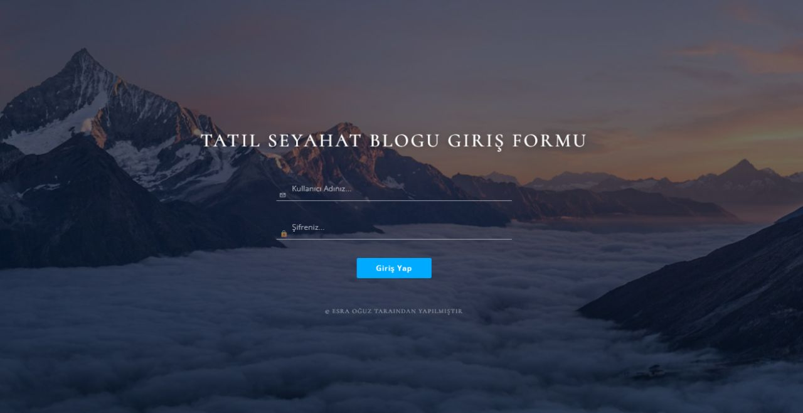

---

### 🌐 Kullanıcı Sayfaları

<table>
  <tr>
    <td align="center"><b>Ana Sayfa - 1</b></td>
    <td align="center"><b>Ana Sayfa - 2</b></td>
  </tr>
  <tr>
    <td>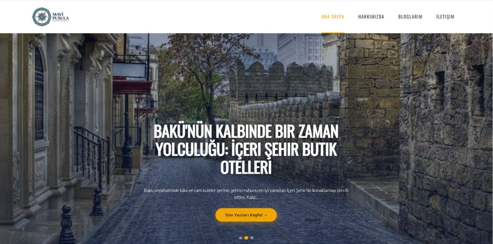</td>
    <td>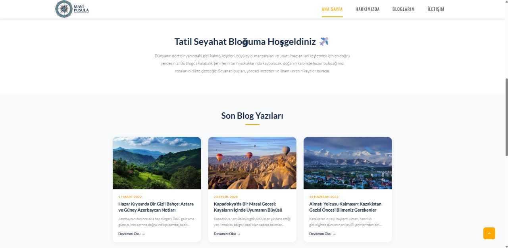</td>
  </tr>
  <tr>
    <td align="center"><b>Ana Sayfa - 3</b></td>
    <td align="center"><b>Hakkımızda</b></td>
  </tr>
  <tr>
    <td>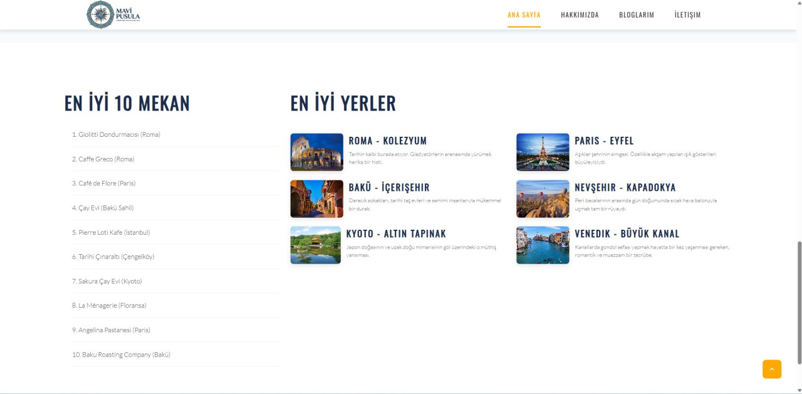</td>
    <td>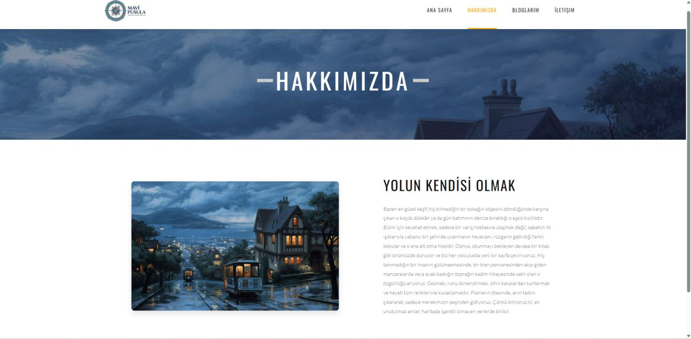</td>
  </tr>
  <tr>
    <td align="center"><b>Bloglarım</b></td>
    <td align="center"><b>Blog Detay</b></td>
  </tr>
  <tr>
    <td>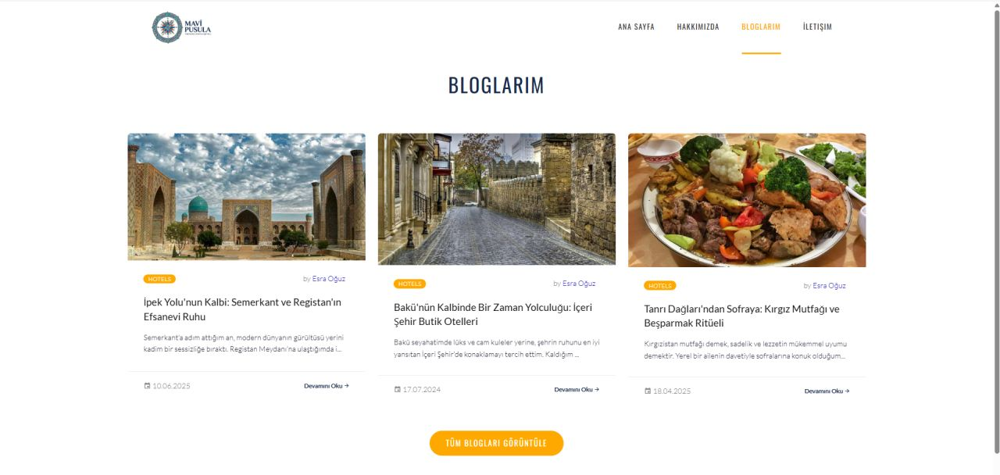</td>
    <td>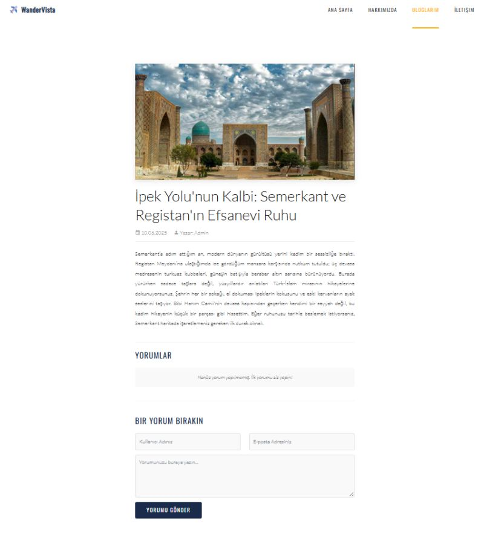</td>
  </tr>
  <tr>
    <td align="center"><b>İletişim</b></td>
    <td></td>
  </tr>
  <tr>
    <td>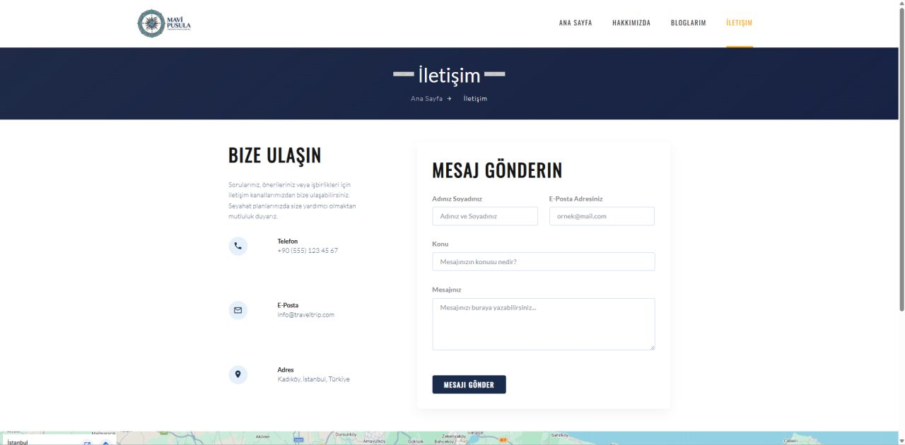</td>
    <td></td>
  </tr>
</table>

---

### 🔐 Admin Paneli

<table>
  <tr>
    <td align="center"><b>Dashboard</b></td>
    <td align="center"><b>Blog Yönetimi</b></td>
  </tr>
  <tr>
    <td>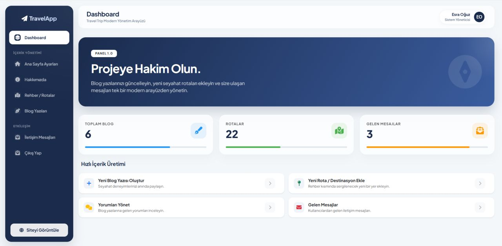</td>
    <td>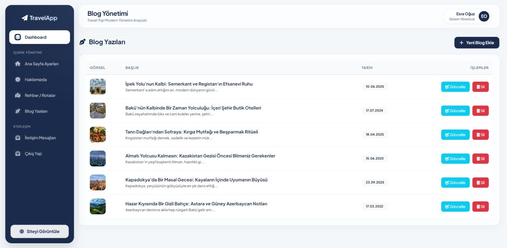</td>
  </tr>
  <tr>
    <td align="center"><b>İletişim Yönetimi</b></td>
    <td></td>
  </tr>
  <tr>
    <td>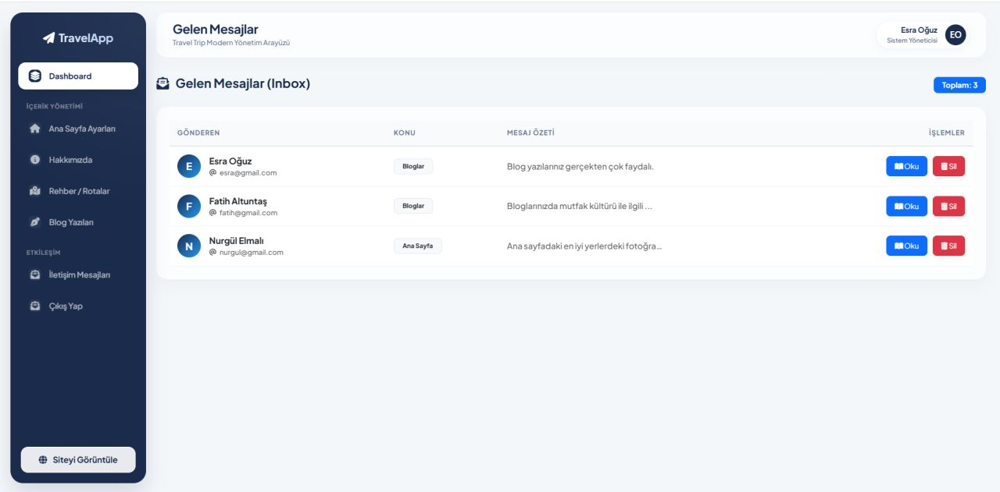</td>
    <td></td>
  </tr>
</table>

---

## 💡 Öğrenilen Konular

Bu proje kapsamında şu konularda deneyim kazanıldı:

- ✅ ASP.NET MVC 5 mimari yapısı (Model-View-Controller)
- ✅ Entity Framework Code First yaklaşımı
- ✅ CRUD (Create, Read, Update, Delete) operasyonları
- ✅ Forms Authentication ile güvenli oturum yönetimi
- ✅ Partial View ile modüler sayfa tasarımı
- ✅ Bootstrap 5 ile responsive arayüz geliştirme
- ✅ Glassmorphism efektli modern UI tasarımı
- ✅ Ülke-Destinasyon gibi ilişkisel veritabanı yapıları
- ✅ ViewBag ile View'a dinamik veri aktarımı

---

## 📄 Lisans

Bu proje eğitim amaçlı geliştirilmiştir.

---

<div align="center">
  <p>⭐ Projeyi beğendiyseniz yıldız vermeyi unutmayın!</p>
  <p>Geliştirici: <strong>Esra Oğuz</strong></p>
</div>
